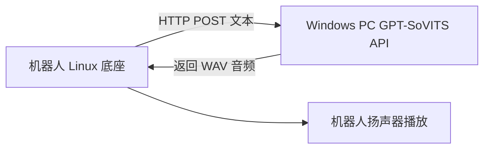

# GPT-SoVITS 蕾姆语音 PC 中转站：工作总结与完整调用教程

## 1. 文档目的

本文记录从检查蕾姆模型文件，到在 Windows PC 上运行 GPT-SoVITS、生成中文语音、开放 HTTP API 的完整过程。

目标架构是：



机器人暂时不运行完整模型，只负责：

1. 向 PC 发送待合成文本。
2. 接收 PC 返回的 WAV 数据。
3. 保存或直接播放音频。

---

## 2. 当前已完成的结果

截至 2026-08-15，已经完成：

- 识别现有模型为 GPT-SoVITS 模型组合。
- 下载并解压 GPT-SoVITS 源码。
- 创建 Python 虚拟环境。
- 放置蕾姆 GPT 与 SoVITS 自定义权重。
- 补齐中文 RoBERTa、中文 HuBERT、fast-langdetect 等基础资源。
- 修复 Windows 下 `jieba_fast` 缺失问题。
- 绕过 `torchaudio/torchcodec` 读取参考音频时的 DLL 问题。
- 启动 GPT-SoVITS `api_v2.py` HTTP 服务。
- 使用日文参考音频成功生成中文语音。
- 成功生成短测试音频和长测试音频。

已验证输出：

| 文件 | 大小 | 说明 |
|---|---:|---|
| `E:\ai-voice\outputs\leimu_test_short.wav` | 106284 字节 | “你好。”短句测试 |
| `E:\ai-voice\outputs\leimu_test_long.wav` | 约 2 MB | 较长中文连续试听 |

---

## 3. 当前目录结构

### 3.1 GPT-SoVITS 主目录

```text
E:\ai-voice\GPT-SoVITS\
├─ .venv\                         # Python 虚拟环境
├─ api_v2.py                       # HTTP API 服务入口
├─ GPT_weights_v2\
│  └─ leimu-e20.ckpt              # 蕾姆 GPT 语义模型权重
├─ SoVITS_weights_v2\
│  └─ leimu_e25_s625.pth          # 蕾姆 SoVITS 声学模型权重
└─ GPT_SoVITS\
   ├─ configs\
   │  ├─ tts_infer.yaml
   │  └─ tts_infer_leimu_api.yaml # 本次 API 专用配置
   ├─ pretrained_models\
   │  ├─ chinese-hubert-base\
   │  │  ├─ config.json
   │  │  ├─ preprocessor_config.json
   │  │  └─ pytorch_model.bin
   │  ├─ chinese-roberta-wwm-ext-large\
   │  │  ├─ config.json
   │  │  ├─ tokenizer.json
   │  │  └─ pytorch_model.bin
   │  └─ fast_langdetect\
   │     └─ lid.176.bin
   ├─ text\
   │  ├─ chinese.py               # 已增加 jieba 回退
   │  ├─ chinese2.py              # 已增加 jieba 回退
   │  └─ tone_sandhi.py           # 已增加 jieba 回退
   └─ TTS_infer_pack\
      └─ TTS.py                   # 参考音频改用 librosa 读取
```

### 3.2 原始蕾姆资源目录

```text
E:\雷姆\雷姆\
├─ leimu-e20.ckpt
├─ leimu_e25_s625.pth
├─ お出かけですかでは、転んでも泣かないおまじないを。.wav
├─ 翻译文件.txt
└─ 语音文件\
```

当前推理所用参考音频：

```text
E:\雷姆\雷姆\お出かけですかでは、転んでも泣かないおまじないを。.wav
```

### 3.3 输出目录

```text
E:\ai-voice\outputs\
├─ leimu_test_short.wav
├─ leimu_test_long.wav
└─ leimu_test_noprompt.wav
```

---

## 4. 当前可运行环境

当前机器实测环境：

| 组件 | 版本或状态 |
|---|---|
| Windows | Windows 10/11 环境 |
| Python | 3.11.1 |
| PyTorch | 2.9.1+cpu |
| torchaudio | 2.9.1+cpu |
| CUDA | 当前虚拟环境不可用 |
| librosa | 0.11.0 |
| FastAPI | 0.141.1 |
| Uvicorn | 0.52.3 |
| PyYAML | 6.0.3 |
| torchcodec | 0.16.0 |
| pyopenjtalk-prebuilt | 0.3.0 |
| fast-langdetect | 1.0.1 |
| jieba | 0.42.1 |

注意：电脑有 RTX 3070，但当前虚拟环境实际加载的是 CPU 版 PyTorch，因此目前推理走 CPU。后续可单独安装匹配显卡驱动的 CUDA 版 PyTorch，以降低延迟。

---

## 5. 蕾姆 API 专用配置

使用以下配置文件：

```text
E:\ai-voice\GPT-SoVITS\GPT_SoVITS\configs\tts_infer_leimu_api.yaml
```

关键配置如下：

```yaml
custom:
  bert_base_path: GPT_SoVITS/pretrained_models/chinese-roberta-wwm-ext-large
  cnhuhbert_base_path: GPT_SoVITS/pretrained_models/chinese-hubert-base
  device: cpu
  is_half: false
  t2s_weights_path: GPT_weights_v2/leimu-e20.ckpt
  version: v1
  vits_weights_path: SoVITS_weights_v2/leimu_e25_s625.pth
```

字段含义：

- `t2s_weights_path`：GPT 语义模型，主要控制文本到语义 Token 的生成。
- `vits_weights_path`：SoVITS 声学模型，主要控制音色和波形生成。
- `bert_base_path`：中文文本特征模型。
- `cnhuhbert_base_path`：参考音频特征模型。
- `device: cpu`：当前使用 CPU 推理。
- `is_half: false`：CPU 不使用 FP16 半精度。
- `version: v1`：当前模型加载时按 v1 结构运行。

虽然权重文件放在名称带 `_v2` 的目录中，但实际启动日志将 SoVITS 权重识别为 v1 结构，因此专用配置使用 `version: v1`。不要只根据目录名判断模型版本。

---

## 6. 本次做过的源码兼容修改

迁移到重新下载的干净 GPT-SoVITS 源码时，需要重新应用这些修改，或者复制当前已修改的源码目录。

### 6.1 `jieba_fast` 回退到普通 `jieba`

修改文件：

```text
GPT_SoVITS\text\chinese.py
GPT_SoVITS\text\chinese2.py
GPT_SoVITS\text\tone_sandhi.py
```

核心写法：

```python
try:
    import jieba_fast as jieba
except ImportError:
    import jieba
```

涉及词性标注时使用：

```python
try:
    import jieba_fast as _jieba
    import jieba_fast.posseg as psg
except ImportError:
    import jieba as _jieba
    import jieba.posseg as psg
```

原因：Windows 当前环境没有用于编译 `jieba_fast` 的 Microsoft C++ Build Tools，普通 `jieba` 可以满足推理需要。

### 6.2 参考音频改用 librosa 读取

修改文件：

```text
GPT_SoVITS\TTS_infer_pack\TTS.py
```

在 `_get_ref_spec()` 中，将：

```python
raw_audio, raw_sr = torchaudio.load(ref_audio_path)
raw_audio = raw_audio.to(self.configs.device).float()
```

改为：

```python
raw_audio, raw_sr = librosa.load(ref_audio_path, sr=None, mono=False)
raw_audio = np.asarray(raw_audio)
if raw_audio.ndim == 1:
    raw_audio = np.expand_dims(raw_audio, axis=0)
raw_audio = torch.from_numpy(raw_audio).to(self.configs.device).float()
```

原因：当前 Windows 环境中，`torchaudio.load()` 会要求 `torchcodec`，而 `torchcodec` 又无法加载 `libtorchcodec_image.dll`。使用项目已经依赖的 `librosa` 可以稳定读取 WAV。

---

## 7. 首次准备步骤

### 7.1 激活工作目录

在 PowerShell 中执行：

```powershell
Set-Location 'E:\ai-voice\GPT-SoVITS'
```

### 7.2 确认虚拟环境

```powershell
.\.venv\Scripts\python.exe --version
```

预期输出：

```text
Python 3.11.1
```

### 7.3 安装本次额外使用的依赖

如果迁移后环境缺少这些包，执行：

```powershell
.\.venv\Scripts\python.exe -m pip install jieba fast-langdetect pyopenjtalk-prebuilt torchcodec
```

其中：

- `jieba`：中文分词回退实现。
- `fast-langdetect`：混合语言文本识别。
- `pyopenjtalk-prebuilt`：处理日语参考文本时需要。
- `torchcodec`：当前已安装，但由于 DLL 问题，参考 WAV 实际改用 librosa 读取。

### 7.4 确认基础模型完整

必须至少存在：

```text
GPT_SoVITS\pretrained_models\chinese-roberta-wwm-ext-large\pytorch_model.bin
GPT_SoVITS\pretrained_models\chinese-hubert-base\pytorch_model.bin
GPT_SoVITS\pretrained_models\fast_langdetect\lid.176.bin
```

`lid.176.bin` 当前大小约 125 MB。若缺失，可以先创建目录，再让 `fast-langdetect` 自动下载：

```powershell
New-Item -ItemType Directory -Force `
  'E:\ai-voice\GPT-SoVITS\GPT_SoVITS\pretrained_models\fast_langdetect'
```

随后运行一次检测：

```powershell
.\.venv\Scripts\python.exe -c "from pathlib import Path; import fast_langdetect.infer as m; d=m.LangDetector(m.LangDetectConfig(cache_dir=Path(r'GPT_SoVITS/pretrained_models/fast_langdetect'))); print(d.detect('hello 你好', model='auto'))"
```

预期会下载 `lid.176.bin`，最后返回类似：

```text
[{'lang': 'zh', 'score': 0.77...}]
```

---

## 8. 启动本机 API 服务

### 8.1 仅本机访问

```powershell
Set-Location 'E:\ai-voice\GPT-SoVITS'
$env:PYTHONPATH='E:\ai-voice\GPT-SoVITS;E:\ai-voice\GPT-SoVITS\GPT_SoVITS'
$env:TEMP='E:\ai-voice\tmp'
$env:TMP='E:\ai-voice\tmp'
.\.venv\Scripts\python.exe api_v2.py `
  -a 127.0.0.1 `
  -p 9880 `
  -c GPT_SoVITS/configs/tts_infer_leimu_api.yaml
```

成功标志：

```text
Loading Text2Semantic weights from GPT_weights_v2/leimu-e20.ckpt
Loading VITS weights from SoVITS_weights_v2/leimu_e25_s625.pth
Loading BERT weights from GPT_SoVITS/pretrained_models/chinese-roberta-wwm-ext-large
Loading CNHuBERT weights from GPT_SoVITS/pretrained_models/chinese-hubert-base
Uvicorn running on http://127.0.0.1:9880
```

### 8.2 允许机器人通过局域网访问

启动时将绑定地址改为 `0.0.0.0`：

```powershell
Set-Location 'E:\ai-voice\GPT-SoVITS'
$env:PYTHONPATH='E:\ai-voice\GPT-SoVITS;E:\ai-voice\GPT-SoVITS\GPT_SoVITS'
$env:TEMP='E:\ai-voice\tmp'
$env:TMP='E:\ai-voice\tmp'
.\.venv\Scripts\python.exe api_v2.py `
  -a 0.0.0.0 `
  -p 9880 `
  -c GPT_SoVITS/configs/tts_infer_leimu_api.yaml
```

查询 PC 局域网 IPv4 地址：

```powershell
Get-NetIPAddress -AddressFamily IPv4 |
  Where-Object { $_.IPAddress -notlike '127.*' -and $_.PrefixOrigin -ne 'WellKnown' } |
  Select-Object InterfaceAlias,IPAddress
```

机器人请求地址应类似：

```text
http://192.168.1.100:9880/tts
```

还需要确保：

- PC 与机器人位于同一局域网。
- Windows 防火墙允许 TCP 9880 入站。
- 路由器未开启客户端隔离。
- 当前 API 未实现鉴权，不要直接暴露到公网。

---

## 9. 使用 PowerShell 生成蕾姆中文语音

### 9.1 最小短句示例

```powershell
$body = @{
  text = '你好。'
  text_lang = 'zh'
  ref_audio_path = 'E:\雷姆\雷姆\お出かけですかでは、転んでも泣かないおまじないを。.wav'
  prompt_lang = 'ja'
  prompt_text = ''
  text_split_method = 'cut5'
  batch_size = 1
  media_type = 'wav'
  streaming_mode = $false
  parallel_infer = $false
} | ConvertTo-Json -Depth 4

Invoke-WebRequest `
  -Uri 'http://127.0.0.1:9880/tts' `
  -Method Post `
  -ContentType 'application/json; charset=utf-8' `
  -Body $body `
  -OutFile 'E:\ai-voice\outputs\leimu_test.wav'
```

### 9.2 较长文本示例

```powershell
$body = @{
  text = '你好，我是蕾姆。今天先陪你做一个长一点的试听。如果你正在调试机器人，也不要着急，我们可以先让电脑稳定说话，再慢慢接到机器人底座上。'
  text_lang = 'zh'
  ref_audio_path = 'E:\雷姆\雷姆\お出かけですかでは、転んでも泣かないおまじないを。.wav'
  prompt_lang = 'ja'
  prompt_text = ''
  text_split_method = 'cut5'
  batch_size = 1
  media_type = 'wav'
  streaming_mode = $false
  parallel_infer = $false
} | ConvertTo-Json -Depth 4

Invoke-WebRequest `
  -Uri 'http://127.0.0.1:9880/tts' `
  -Method Post `
  -ContentType 'application/json; charset=utf-8' `
  -Body $body `
  -OutFile 'E:\ai-voice\outputs\leimu_long.wav'
```

---

## 10. 使用 Python 调用 API

适合放入另一个 Python 工作区，也可以作为机器人端调用代码的原型。

先安装：

```bash
pip install requests
```

调用示例：

```python
from pathlib import Path

import requests


API_URL = "http://127.0.0.1:9880/tts"
OUTPUT_PATH = Path(r"E:\ai-voice\outputs\leimu_from_python.wav")

payload = {
    "text": "你好，我是蕾姆。今天也请多关照。",
    "text_lang": "zh",
    "ref_audio_path": r"E:\雷姆\雷姆\お出かけですかでは、転んでも泣かないおまじないを。.wav",
    "prompt_lang": "ja",
    "prompt_text": "",
    "text_split_method": "cut5",
    "batch_size": 1,
    "media_type": "wav",
    "streaming_mode": False,
    "parallel_infer": False,
}

response = requests.post(API_URL, json=payload, timeout=300)
response.raise_for_status()

OUTPUT_PATH.parent.mkdir(parents=True, exist_ok=True)
OUTPUT_PATH.write_bytes(response.content)
print(f"已生成：{OUTPUT_PATH}，大小：{OUTPUT_PATH.stat().st_size} 字节")
```

注意：`ref_audio_path` 是 PC 服务端看到的路径。机器人端不能把机器人自己的本地路径填进这里，除非先将音频上传或改造 API。当前固定使用 PC 上的参考音频路径最简单。

---

## 11. 机器人 Linux 端调用示例

假设 PC 的局域网 IP 为 `192.168.1.100`，API 已绑定 `0.0.0.0:9880`。

### 11.1 curl 示例

```bash
curl -X POST 'http://192.168.1.100:9880/tts' \
  -H 'Content-Type: application/json' \
  -d '{
    "text": "主人，我已经收到消息了。",
    "text_lang": "zh",
    "ref_audio_path": "E:\\雷姆\\雷姆\\お出かけですかでは、転んでも泣かないおまじないを。.wav",
    "prompt_lang": "ja",
    "prompt_text": "",
    "text_split_method": "cut5",
    "batch_size": 1,
    "media_type": "wav",
    "streaming_mode": false,
    "parallel_infer": false
  }' \
  --output /tmp/leimu_reply.wav
```

播放音频可根据机器人系统选择：

```bash
aplay /tmp/leimu_reply.wav
```

或：

```bash
ffplay -nodisp -autoexit /tmp/leimu_reply.wav
```

### 11.2 Linux Python 示例

```python
from pathlib import Path

import requests


PC_API = "http://192.168.1.100:9880/tts"
output = Path("/tmp/leimu_reply.wav")

payload = {
    "text": "主人，我已经收到消息了。",
    "text_lang": "zh",
    "ref_audio_path": r"E:\雷姆\雷姆\お出かけですかでは、転んでも泣かないおまじないを。.wav",
    "prompt_lang": "ja",
    "prompt_text": "",
    "text_split_method": "cut5",
    "batch_size": 1,
    "media_type": "wav",
    "streaming_mode": False,
    "parallel_infer": False,
}

response = requests.post(PC_API, json=payload, timeout=300)
response.raise_for_status()
output.write_bytes(response.content)
```

---

## 12. API 字段说明

| 字段 | 当前值 | 作用 |
|---|---|---|
| `text` | 中文句子 | 最终要说的内容 |
| `text_lang` | `zh` | 目标文本按中文处理 |
| `ref_audio_path` | PC 上的 WAV 路径 | 提供说话人音色和发声状态 |
| `prompt_lang` | `ja` | 参考音频原语言是日语 |
| `prompt_text` | 当前为空 | 参考音频对应原文，可选 |
| `text_split_method` | `cut5` | 长文本切句方式 |
| `batch_size` | `1` | 单批推理，当前更稳 |
| `media_type` | `wav` | 返回 WAV 音频 |
| `streaming_mode` | `false` | 等整段生成后一次返回 |
| `parallel_infer` | `false` | 当前 prompt-free 模式使用朴素推理更稳 |

### 12.1 日文参考音频能否生成中文

可以。参考音频与目标文本不要求同语言：

- 日文参考音频负责提供音色和语气。
- `prompt_lang: ja` 表示参考音频语言。
- `text_lang: zh` 表示最终输出中文。

如果有准确的日文原文，可以把它放入 `prompt_text`。原文必须和参考音频实际内容一致，不能用中文翻译替代日文原文。

当前已经验证 `prompt_text` 为空也能成功生成中文语音。

---

## 13. 参考音频要求

建议参考音频满足：

- 时长 3 到 10 秒。当前代码会检查该范围。
- 只有一个说话人。
- 人声清楚、音量稳定。
- 尽量没有音乐、环境噪声、混响和爆音。
- 情绪与希望生成的语气接近。
- 最好来自目标角色原始声音，而不是经过多次模型处理的二手生成音频。

现有参考音频已经能工作，但来源和处理历史不完全明确，可能带有压缩、降噪、切片或二次生成造成的失真。后续如果追求更高质量，建议收集原始素材重新切片、标注和训练。

---

## 14. 关于自然笑声和情绪

长语音中出现过一次很自然的轻微笑声或气声。输入文本中没有写“呵呵”“轻笑”等标记，因此它不是显式写入的文本内容。

更可能的来源是：

- 模型权重学到的角色韵律。
- 参考音频带来的发声状态。
- 随机采样产生的自然气口或尾音。
- 跨语言生成中产生的非完全可控细节。

它听起来像笑声，但不一定表示模型在语义上理解了“这里应该笑”。也可能只是气声、松弛尾音或韵律组合。

后续可通过固定文本、改变随机种子和参考音频进行 A/B 测试，判断该效果主要来自模型、参考音频还是随机采样。

---

## 15. 常见错误与本次解决办法

### 15.1 找不到中文 RoBERTa 权重

错误类似：

```text
no file named pytorch_model.bin found in chinese-roberta-wwm-ext-large
```

解决：确保文件位于：

```text
GPT_SoVITS\pretrained_models\chinese-roberta-wwm-ext-large\pytorch_model.bin
```

本次下载器曾把它放入多余的 `pretrained_models\pretrained_models\...` 层级，后来移动到正确位置。

### 15.2 `No module named jieba_fast`

解决：安装普通 `jieba`，并应用第 6.1 节的回退补丁。

### 15.3 `TorchCodec is required`

或：

```text
Could not load libtorchcodec_image.dll
```

解决：在 `TTS.py` 中使用 librosa 读取参考音频，见第 6.2 节。

### 15.4 `No module named pyopenjtalk`

解决：

```powershell
.\.venv\Scripts\python.exe -m pip install pyopenjtalk-prebuilt
```

首次处理日文参考文本时，还会自动下载约 22.6 MB 的 Open JTalk 字典。

### 15.5 `fast-langdetect: Cache directory not found`

解决：先创建：

```text
GPT_SoVITS\pretrained_models\fast_langdetect
```

再触发下载 `lid.176.bin`，见第 7.4 节。

### 15.6 API 启动但 WebUI 报 Gradio 异常

本次 WebUI 曾出现 Gradio JSON Schema 兼容错误。机器人集成不依赖 WebUI，因此直接使用 `api_v2.py`，不影响 HTTP 合成服务。

### 15.7 返回 200 但输出文件为 0 字节

如果客户端请求进程提前超时或被清理，服务端即使完成合成，客户端文件也可能为空。应让客户端等待完整响应，并在完成后检查文件大小：

```powershell
Get-Item 'E:\ai-voice\outputs\leimu_test.wav' |
  Select-Object FullName,Length,LastWriteTime
```

文件大小必须大于 0。

---

## 16. 迁移到另一个工作区的最小清单

### 16.1 如果另一个工作区只负责调用

不必复制整个 GPT-SoVITS。只需要：

- 保持当前 PC 上 GPT-SoVITS API 运行。
- 在新工作区加入 HTTP 客户端代码。
- 配置 PC 的 IP 和端口 `9880`。
- 保存返回的 WAV，交给机器人播放器。

这是推荐方式。

### 16.2 如果要把完整服务也迁走

至少复制或重新准备：

```text
E:\ai-voice\GPT-SoVITS\                 # 完整源码与虚拟环境之外的资源
E:\雷姆\雷姆\                          # 参考音频与原始模型备份
```

必须重点保留：

```text
GPT_weights_v2\leimu-e20.ckpt
SoVITS_weights_v2\leimu_e25_s625.pth
GPT_SoVITS\configs\tts_infer_leimu_api.yaml
GPT_SoVITS\pretrained_models\chinese-hubert-base\
GPT_SoVITS\pretrained_models\chinese-roberta-wwm-ext-large\
GPT_SoVITS\pretrained_models\fast_langdetect\
GPT_SoVITS\TTS_infer_pack\TTS.py
GPT_SoVITS\text\chinese.py
GPT_SoVITS\text\chinese2.py
GPT_SoVITS\text\tone_sandhi.py
```

不建议直接复制 `.venv` 到另一台机器。更稳妥的做法是在目标机器重新创建虚拟环境并安装依赖，因为虚拟环境内包含绝对路径和平台相关二进制文件。

---

## 17. 推荐的后续工程步骤

1. 将 API 从 `127.0.0.1` 改为 `0.0.0.0`，在局域网内验证机器人可访问。
2. 给机器人端增加请求超时、失败重试和音频缓存。
3. 将 PC 参考音频路径固定在服务端配置中，避免机器人每次传 Windows 路径。
4. 为 API 增加简单鉴权、请求队列和并发限制。
5. 安装 CUDA 版 PyTorch，让 RTX 3070 参与推理，降低延迟。
6. 收集更可靠的原始角色音频和准确日文文本，重新训练高质量模型。
7. 按温柔、开心、安慰、严肃等情绪分别整理素材，训练或保存多套权重。
8. 对不同参考音频、随机种子、语速和采样参数做 A/B 试听记录。

---

## 18. 当前结论

当前方案已经完成最小闭环：

```text
中文文本
  -> PC 上的 GPT-SoVITS API
  -> 蕾姆自定义 GPT/SoVITS 权重
  -> 日文参考音频提供音色与语气
  -> 返回可播放的中文 WAV
```

因此，下一阶段可以把主要精力从“能否生成”转到：

- 机器人局域网调用。
- GPU 加速和响应延迟。
- 音频播放链路。
- 原始素材重建。
- 多情绪模型与参考音频管理。
